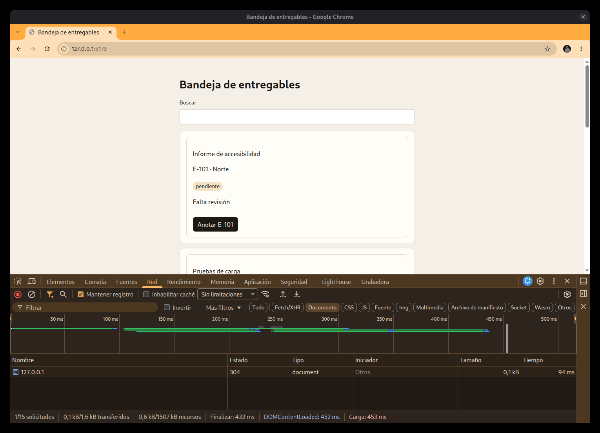
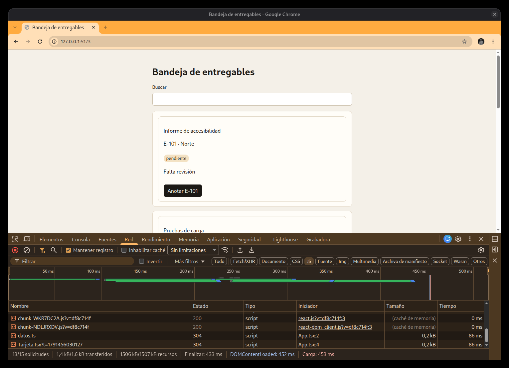
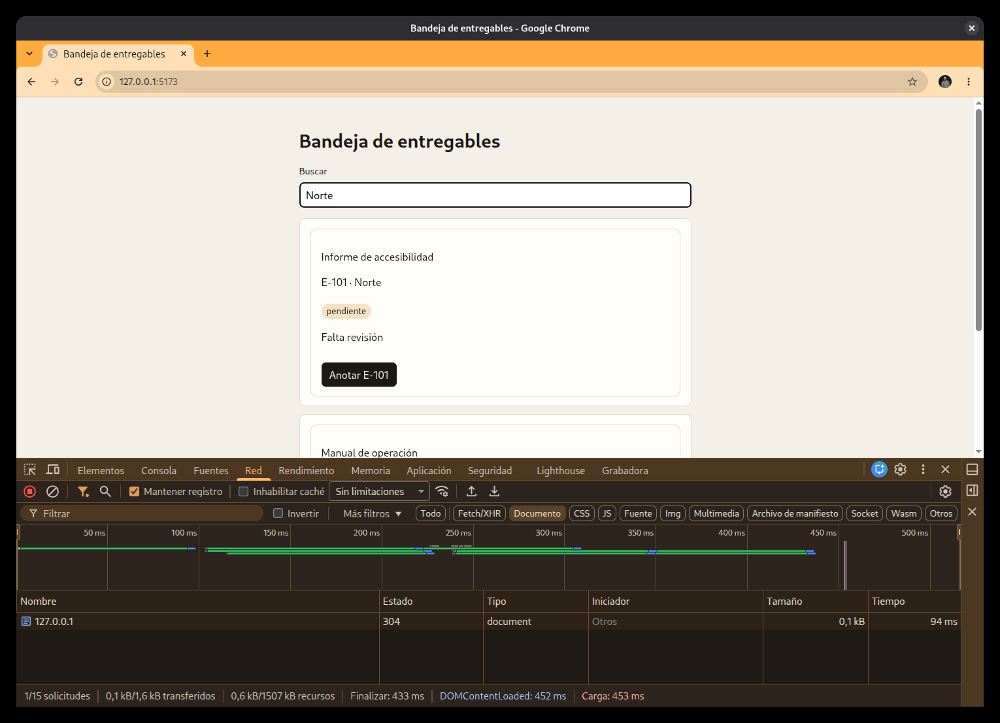
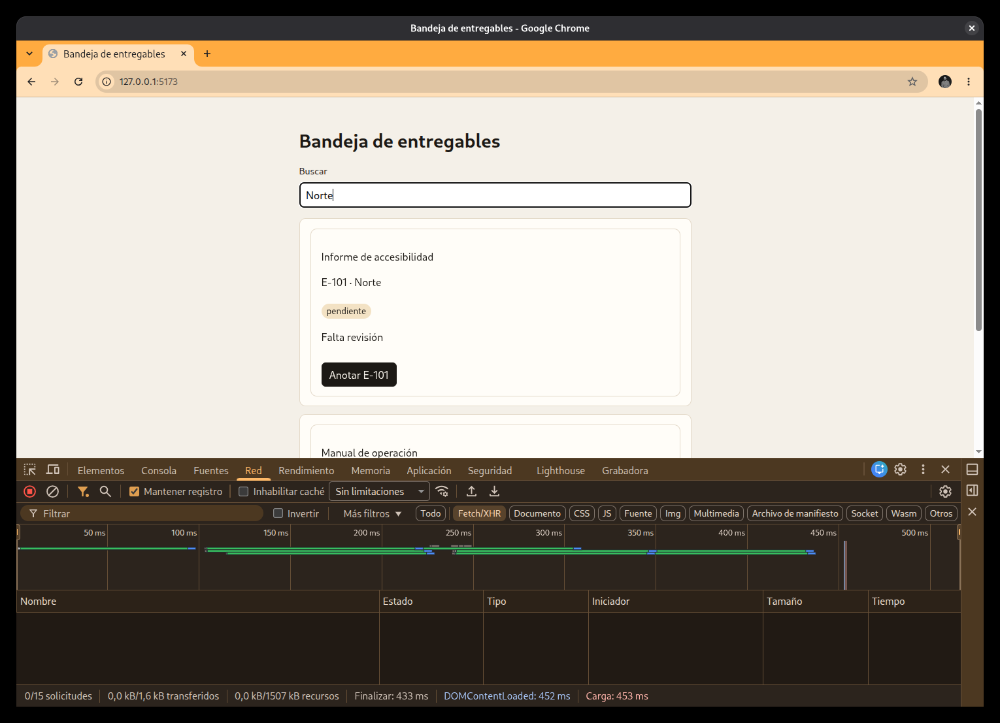
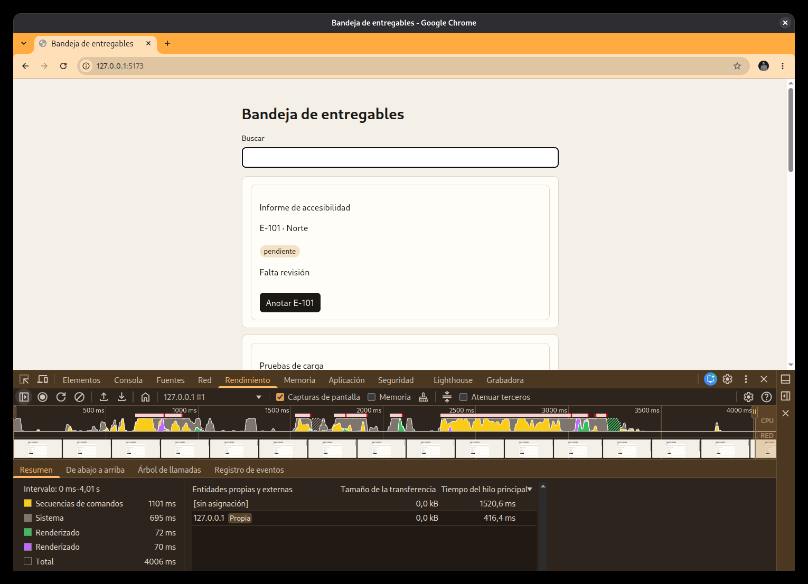

# J06-02 — Chrome DevTools

[← Página anterior](J06-01-mapa.md) · [Siguiente página →](J06-03-react.md)

F12 abre las herramientas del navegador. Aquí se usan dos pestañas: **Red** (en inglés, Network) y **Rendimiento** (en inglés, Performance). No conocen los componentes de React. Dicen qué se pidió y en qué se fue el tiempo.

La bandeja sigue en `npm run dev`, en `http://127.0.0.1:5173`. Los archivos que salen son los módulos de Vite. Las mismas pestañas existen en una página ya publicada. Cambia el nombre del archivo, no el gesto.

## Red

**Qué se puede hacer.** Ver cada petición de una recarga o de un gesto: el HTML, los módulos, y si hubo una llamada de datos.

**Cómo se hace.**

1. F12. Pulsa la pestaña **Red**.
2. El icono del círculo tachado vacía la lista. El nombre del botón es **Borrar registro de red**. Si no lo vacías, se mezclan peticiones de antes.
3. Recarga con F5. La tabla se llena. Vite manda un archivo por módulo, así que hay muchas filas. El pie dice cuántas: en esta captura, 15.
4. En la barra de filtros pulsa **Documento**. En un Chrome en inglés ese filtro se llama Doc. Se queda una fila: el HTML. El tipo es `document`. El nombre es la dirección, `127.0.0.1`. El estado puede ser 200 la primera vez, o 304 si el navegador ya tenía la página. 304 sigue siendo el documento, no un fallo.

5. Pulsa **JS**. Ahí están los módulos. En el dev aparecen `Tarjeta.tsx` y `datos.ts`, cada uno con su petición. En una página publicada esos nombres no existen: verás el paquete, con el nombre que tenga el sitio.

6. Vuelve a **Documento**. Sin borrar la lista, escribe `Norte` en «Buscar». La fila `document` sigue siendo una. En pantalla quedan E-101 y, debajo, el principio de «Manual de operación» (E-103). El filtro de la bandeja no ha vuelto a pedir el HTML.

7. Pulsa **Fetch/XHR**. La tabla queda vacía y el pie marca 0 de esas 15. Esta copia no pide un JSON al teclear: la lista ya estaba en el fuente.

Si la lista estaba llena de antes, el paso 2 evita contar peticiones viejas. El websocket que a veces aparece arriba es el del servidor de desarrollo, no un entregable.

**Para qué sirve.** Separar «la página se volvió a bajar» de «React pintó otra vez con lo que ya tenía». Al autor se le puede decir: al recargar hay un document; al escribir `Norte` no hay otro; Fetch/XHR no pidió datos. `Norte` deja en pantalla E-101 y E-103. Eso es el gesto, para que pueda repetirlo.

En una URL publicada se hace el mismo recuento. El script ya no se llama `Tarjeta.tsx`. El dato que sobrevive es si el HTML y el JSON se repiten al teclear.

## Rendimiento

**Qué se puede hacer.** Grabar unos segundos y ver si el tiempo de ese gesto se fue en script, en pintura o en red.

**Cómo se hace.**

1. Pestaña **Rendimiento**. Al abrirla puede salir **Métricas en directo**: son números de la carga que ya ocurrió (LCP, CLS). No son la grabación del tecleo.
2. A la izquierda hay dos controles. El círculo es **Grabar**. El de al lado es **Grabar y volver a cargar**: recarga la página y graba el arranque. Para el tecleo se usa el círculo, no el de recargar.
3. Círculo. Escribe `Norte` en «Buscar». Bórralo. Vuelve a pulsar el círculo para parar. Si la grabación sale vacía, el círculo no estaba en marcha mientras escribías.
4. Al terminar, el panel **Resumen** parte el intervalo. **Secuencias de comandos** es código ejecutándose. **Renderizado** es pintura. En la tabla de red, la fila de `127.0.0.1` con 0 kB quiere decir que esa grabación no volvió a bajar el HTML.

En esta captura el intervalo dura unos cuatro segundos y las secuencias de comandos se llevan cerca de un segundo. El tramo es el de toda la grabación, no un nombre de componente. Con seis fichas no hace falta que el número sea grande: lo que se lee es si hubo script y si hubo descarga.

**Para qué sirve.** Decir si el gesto costó código o costó red. En esta bandeja, escribir y borrar `Norte` deja tiempo de script y no una descarga nueva. Esa frase no nombra `Tarjeta`. El nombre del componente es la página de React DevTools.

En una URL publicada el círculo se usa igual. El tramo de script apunta al archivo del paquete, no al `.tsx`.
