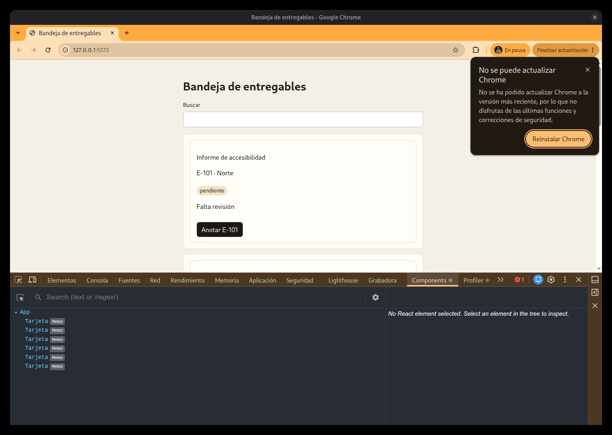
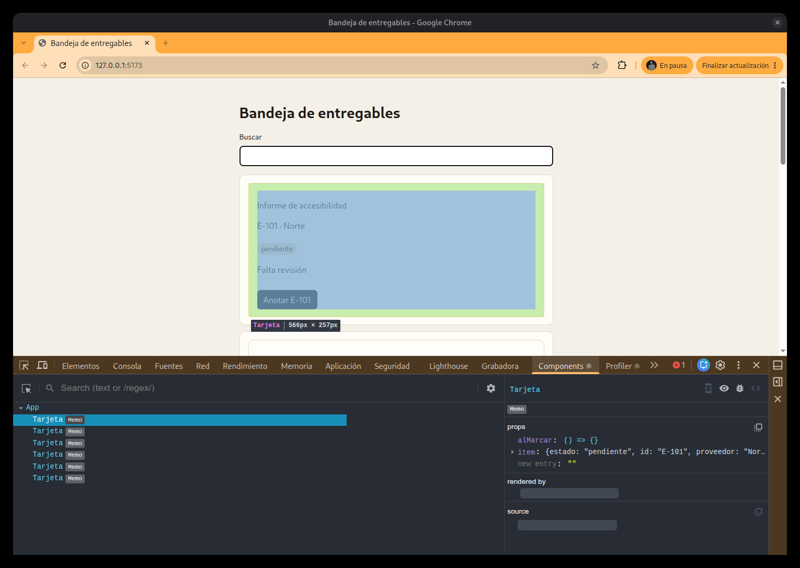
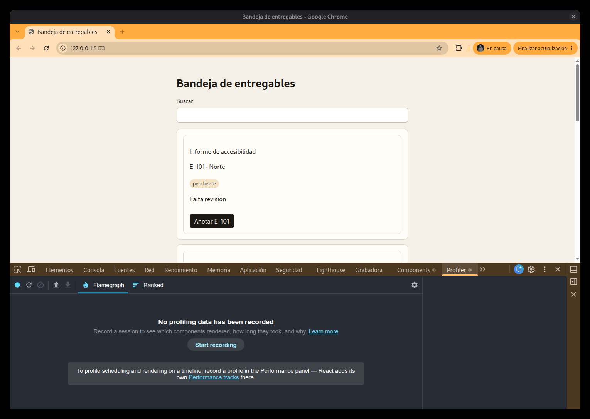
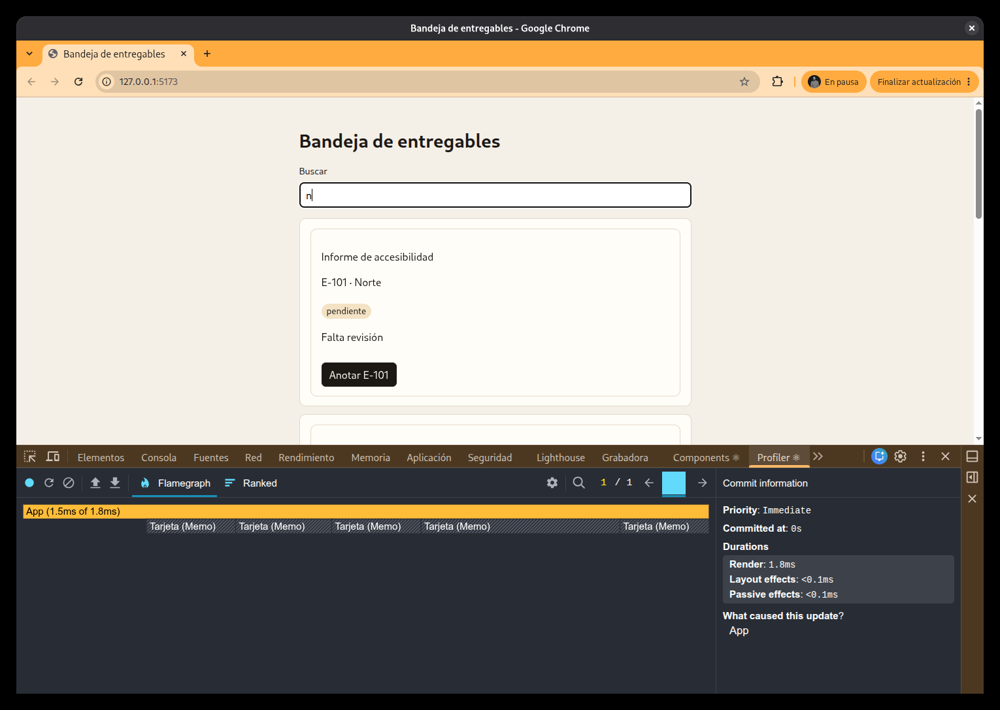
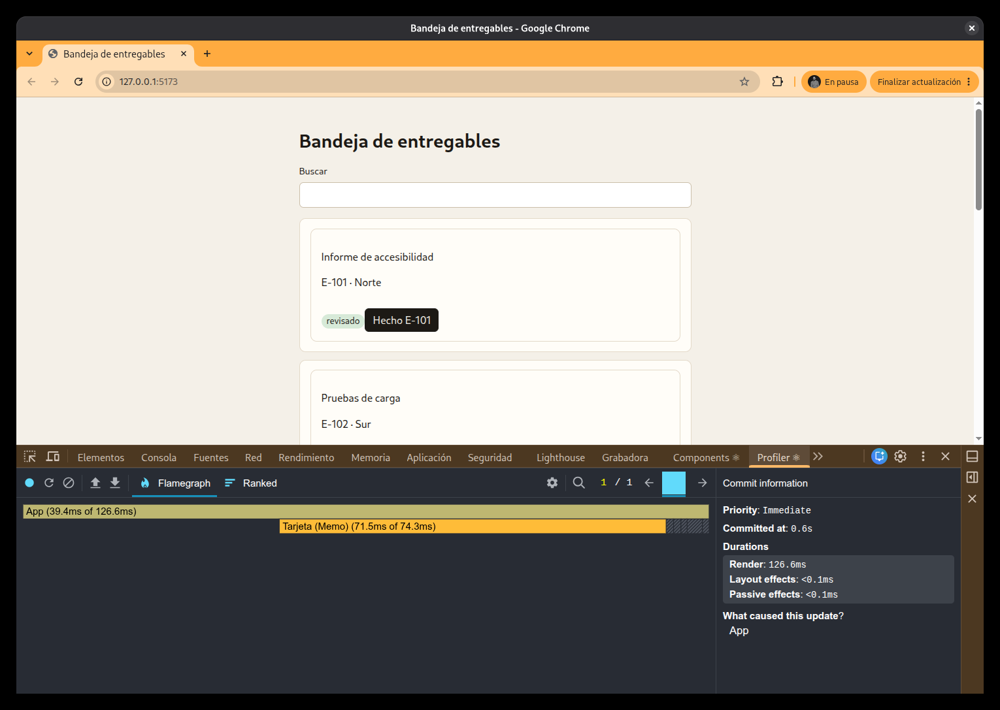

# J06-03 — React DevTools

[← Página anterior](J06-02-devtools.md) · [Siguiente página →](J06-04-lighthouse.md)

React Developer Tools es una extensión. En F12 añade dos pestañas con el logo de React: **Components** y **Profiler**. No son Elementos ni Rendimiento. Rendimiento no lista `Tarjeta`.

Hace falta el build de desarrollo. `npm run dev` lo es. Si solo tienes la página publicada, la extensión puede avisar de que React va en producción y el Profiler no graba. Esta página no cambia de servidor: el uso se explica sobre el dev, y el límite del publicado se dice para no atribuir un clic a un componente cuando no hubo grabación.

Las pestañas pueden quedar a la derecha de la barra, después de Lighthouse. Si no caben, están en `>>`.

## Components

**Qué se puede hacer.** Ver el árbol que React tiene ahora: el padre, los hijos y las props de la ficha que elijas.

**Cómo se hace.**

1. Pestaña **Components**. En el árbol sale `App` y, debajo, una `Tarjeta` por ficha. Si el componente está envuelto en `memo`, la fila lleva la pastilla **Memo**.

2. Pulsa una `Tarjeta`. La página marca esa ficha. A la derecha, **props** enseña lo que recibe. En esta bandeja son `alMarcar` (la función) e `item`. Dentro de `item` están el id, el estado y el proveedor. En la captura, la primera ficha es E-101, `pendiente`, proveedor Norte.

**Para qué sirve.** Saber qué dato le llega a la ficha sin leer el código en ese momento. Si `alMarcar` está y `item` trae el id, el clic de esa ficha tiene a quién avisar y sobre qué entregable. Eso se le puede contar al autor tal cual: la ficha recibe el objeto y la función.

En la página publicada los nombres pueden salir acortados. Si no lees `Tarjeta`, no inventas el nombre.

## Profiler

**Qué se puede hacer.** Grabar un gesto y ver qué componente se ejecutó en ese commit, y un tiempo de render.

**Cómo se hace.**

1. Pestaña **Profiler**. Si aún no hay grabación, el centro dice **Start recording**. Arriba a la izquierda, el círculo azul graba con la página ya abierta. El control de al lado recarga y graba el primer pintado: no es el gesto.

2. Para una letra: pulsa el círculo, o **Start recording**. Clic en «Buscar». Escribe `n`. Para con el mismo círculo, que pasa a ser parar, o con **Stop recording**.
3. Arriba del gráfico hay una barra por commit. Si hay varias, la última es el tecleo. Pulsa esa barra. El gráfico de llamas lista los componentes. Una barra con color se ejecutó. Una barra rayada no se ejecutó en ese commit.

En esta captura la letra `n` ejecutó `App` (1,5 ms de 1,8 ms). Las `Tarjeta` salen como `Tarjeta (Memo)` y rayadas: no volvieron a renderizarse. A la derecha, «What caused this update?» dice `App`. El informe copia esos nombres, no los que uno esperaba. Si en tu copia `Tarjeta` no lleva `memo`, la barra sale del mismo color que `App`: esa ficha sí corrió.

4. Para el clic, recarga si E-101 ya dice «Hecho», hasta ver «Anotar E-101» en «Informe de accesibilidad». E-103 y E-105 también dicen «Anotar»; el botón es el que incluye `E-101`.
5. Círculo, clic en «Anotar E-101», parar, barra del commit. En pantalla el botón pasa a «Hecho E-101» y la pastilla a `revisado`. En el gráfico, `App` y la `Tarjeta` de esa ficha salen en color. Las otras `Tarjeta`, si llevan `memo` y su prop no cambió, siguen rayadas. Red no hace falta: el clic no pide el documento.

**Para qué sirve.** Decirle al autor qué se ejecutó, no solo que la pantalla cambió. Una letra en «Buscar» y el clic en E-101 son dos commits. La letra, con `memo`, mueve `App` y deja las fichas quietas. El clic mueve `App` y la ficha cuyo `item` cambió. El informe copia los nombres que salieron en la barra.

Esas grabaciones exigen el entorno de desarrollo. Con solo la página publicada el Profiler no deja esa barra, y el informe no atribuye el gesto a `Tarjeta`.
