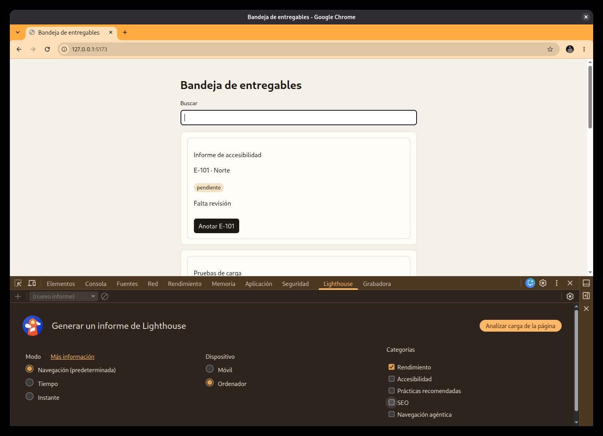
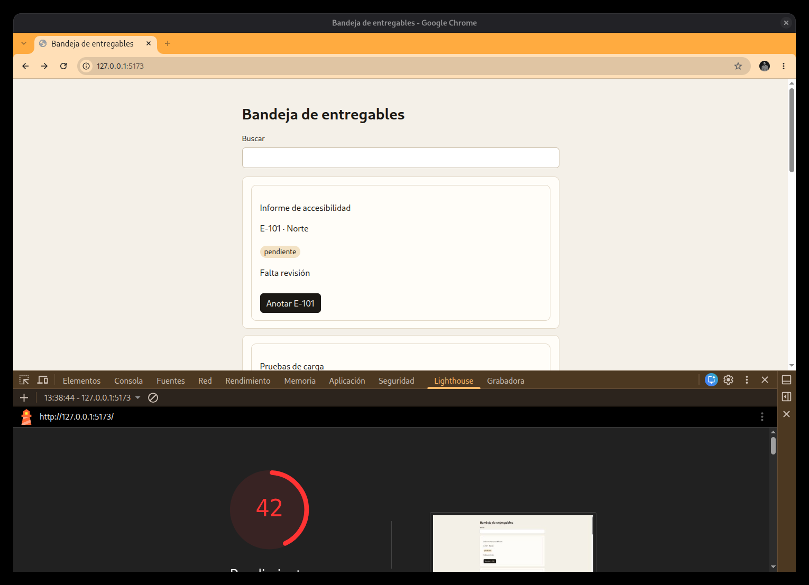

# J06-04 — Lighthouse

[← Página anterior](J06-03-react.md) · [Siguiente página →](J06-05-informe.md)

Lighthouse está en F12. Si no aparece en la barra, está en `>>`. Mide la carga de la URL abierta. No mira qué componente se ejecutó al teclear: eso es el Profiler.

Sirve con el entorno de desarrollo y con una URL publicada. El número es de la URL que analizó. En esta jornada la URL es `http://127.0.0.1:5173` con `npm run dev`. Ese número no se presenta como el de un sitio ya publicado, porque el dev envía un módulo por archivo y React en desarrollo.

## La pasada

**Qué se puede hacer.** Sacar una puntuación de 0 a 100 de la categoría Rendimiento, y leer un peso o un bloqueo si está a la vista. Repetir la pasada en escritorio y en móvil.

**Cómo se hace.**

1. Pestaña **Lighthouse**. El título es «Generar un informe de Lighthouse».
2. **Modo:** deja **Navegación**. Es la opción por defecto. Lighthouse recarga la página y mide esa carga. Tiempo e Instante son otras preguntas.
3. **Dispositivo:** **Ordenador** para la primera pasada. En inglés, Desktop. **Móvil** es la segunda.
4. **Categorías:** deja marcada solo **Rendimiento**. Quita Accesibilidad, Prácticas recomendadas y SEO. Así el número es el de esa categoría y la pasada dura menos. Navegación agéntica se queda sin marcar.
5. **Analizar carga de la página**. En inglés, Analyze page load. El botón recarga solo. Mientras el círculo no ha aparecido, no pulses la bandeja.

6. Al terminar, el número grande es la puntuación de 0 a 100. En esta pasada, sobre el dev y en Ordenador, salió 42. Una segunda pasada en el mismo dispositivo puede variar unos puntos: vale la que salió. No se edita `Tarjeta` para subirla.

7. Para el móvil, nuevo informe (el `+` de la barra del panel), **Móvil**, otra vez solo Rendimiento, y **Analizar carga de la página**. Anotas ese número aparte.

La pasada vuelve a cargar `/`. Una marca hecha antes en una ficha no está en el informe.

**Para qué sirve.** Decirle al autor cómo fue la carga de esta URL, en escritorio y en móvil, sin pedir que persiga la nota. La frase lleva el dispositivo y que mediste el dev. Lighthouse no explica el commit de «Anotar E-101».

En una URL publicada se usan los mismos clics: Navegación, solo Rendimiento, Ordenador y Móvil. Ese número es otro, porque la URL es otra. No sustituye al que salió en `127.0.0.1`.
